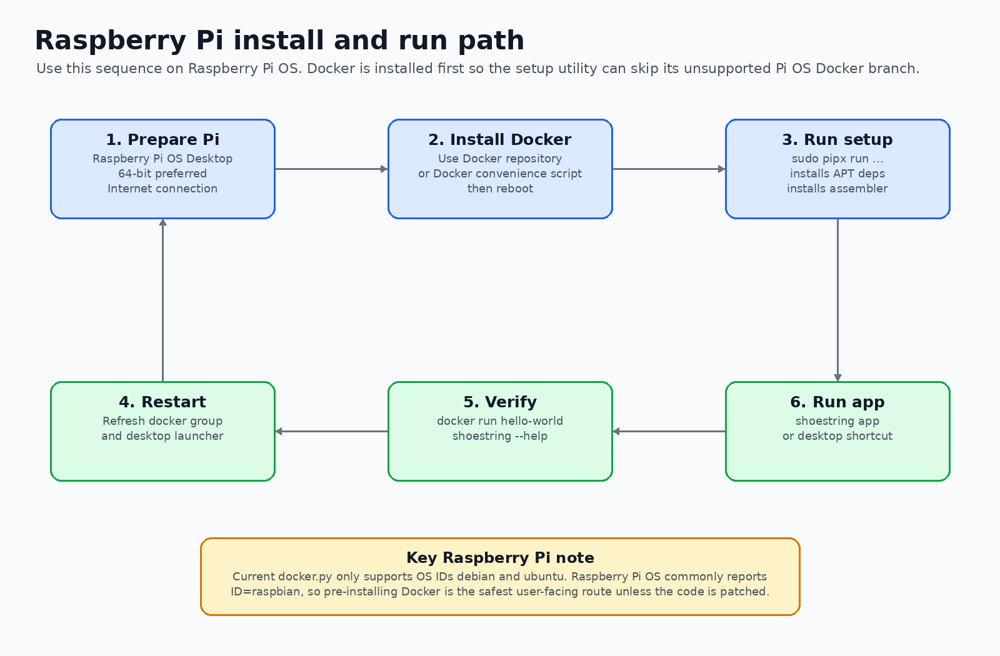
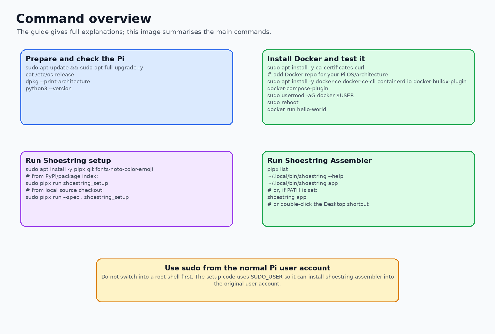
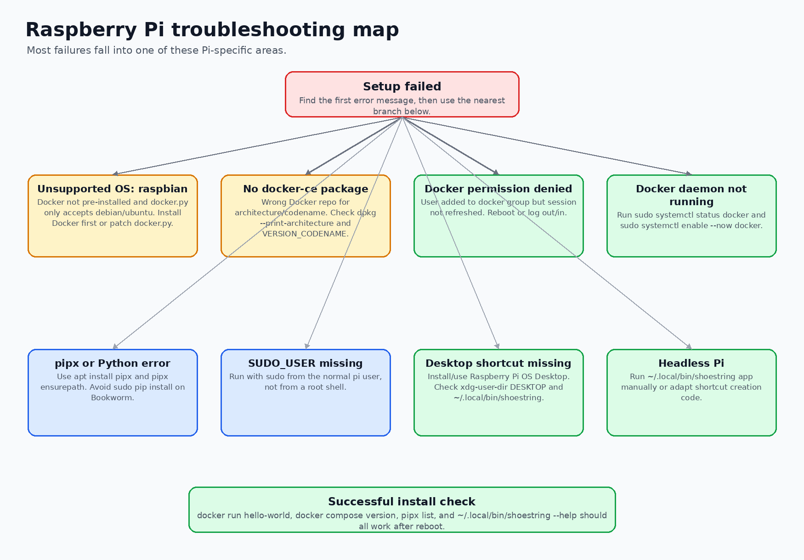

# Running Shoestring Setup on Raspberry Pi



This guide explains how to install and run the `shoestring_setup` utility on a Raspberry Pi. It is written for Raspberry Pi users rather than developers, but it also includes notes on the parts of the code that matter when something goes wrong.

## What this setup utility does

The setup utility prepares a Raspberry Pi to run Digital Shoestring tools by doing three main things:

1. Installing base Linux packages such as `git`, `pipx`, and emoji fonts.
2. Checking whether Docker is installed.
3. Installing or updating `shoestring-assembler` with `pipx`, then creating a Raspberry Pi desktop shortcut.

The key code path is:

```text
src/shoestring_setup/cli.py
  -> src/shoestring_setup/shoestring_setup.py
      -> apt_deps.py
      -> docker.py
      -> shoestring_assembler.py
```

## Raspberry Pi compatibility note

The current code is designed for Linux systems that report their OS ID as `debian` or `ubuntu`.

Raspberry Pi OS commonly reports its OS ID as:

```bash
ID=raspbian
```

This matters because `src/shoestring_setup/docker.py` only enters the Docker installation branch when:

```python
if self.os_env["os_id"] in ["debian", "ubuntu"]:
```

Therefore, on Raspberry Pi OS, the safest installation route is:

1. Install Docker on the Raspberry Pi first.
2. Confirm Docker works.
3. Run `shoestring_setup`.

If Docker is already installed, the setup utility checks `docker -v`, reports that Docker already exists, and skips its own Docker installation step.

## Recommended Raspberry Pi setup

Use:

- Raspberry Pi 4 or Raspberry Pi 5.
- Raspberry Pi OS with Desktop.
- 64-bit Raspberry Pi OS where possible.
- A normal user account with `sudo` rights, usually the `pi` user or the user created during first boot.
- Internet access.

Raspberry Pi OS Lite or a headless Pi can work for command-line use, but the desktop shortcut step may need to be skipped or adapted because the code expects a desktop directory.

## Step 1 — Update the Raspberry Pi

Open a terminal on the Pi and run:

```bash
sudo apt update
sudo apt full-upgrade -y
sudo reboot
```

After the Pi restarts, open a terminal again.

## Step 2 — Check your OS and CPU architecture

Run:

```bash
cat /etc/os-release
dpkg --print-architecture
uname -m
python3 --version
```

Useful values to look for:

| Check | Good value | Meaning |
|---|---|---|
| `VERSION_CODENAME` | `bookworm` or `bullseye` | Raspberry Pi OS base release. |
| `dpkg --print-architecture` | `arm64` | 64-bit Pi OS. Preferred where possible. |
| `dpkg --print-architecture` | `armhf` | 32-bit Pi OS. May still work, but Docker support is more limited. |
| `python3 --version` | `Python 3.10` or newer | Required by `pyproject.toml`. |

## Step 3 — Install basic tools

Install the tools used by the setup process:

```bash
sudo apt install -y git pipx fonts-noto-color-emoji ca-certificates curl
```

Then refresh the normal user's `pipx` path:

```bash
pipx ensurepath
```

Close and reopen the terminal, or run:

```bash
source ~/.profile
```

## Step 4 — Install Docker on Raspberry Pi OS

This is the most important Raspberry Pi-specific step. Install Docker before running `shoestring_setup`, because the current setup code does not directly support the `raspbian` OS ID in its Docker installer.

### Option A — Simple Docker install for development/testing

For a quick development setup, Docker's convenience script is the shortest route:

```bash
curl -fsSL https://get.docker.com -o get-docker.sh
sudo sh get-docker.sh
sudo usermod -aG docker $USER
sudo reboot
```

After rebooting, test Docker:

```bash
docker --version
docker compose version
docker run hello-world
```

If `docker run hello-world` works without `sudo`, Docker is ready.

### Option B — Install from Docker's APT repository

For a more explicit repository-based installation, use the repository URL that matches your Pi OS architecture.

Check the architecture:

```bash
dpkg --print-architecture
```

For 64-bit Raspberry Pi OS (`arm64`), use the Debian repository:

```bash
sudo install -m 0755 -d /etc/apt/keyrings
sudo curl -fsSL https://download.docker.com/linux/debian/gpg -o /etc/apt/keyrings/docker.asc
sudo chmod a+r /etc/apt/keyrings/docker.asc

. /etc/os-release
echo "deb [arch=$(dpkg --print-architecture) signed-by=/etc/apt/keyrings/docker.asc] https://download.docker.com/linux/debian ${VERSION_CODENAME} stable" | sudo tee /etc/apt/sources.list.d/docker.list > /dev/null

sudo apt update
sudo apt install -y docker-ce docker-ce-cli containerd.io docker-buildx-plugin docker-compose-plugin
sudo usermod -aG docker $USER
sudo reboot
```

For 32-bit Raspberry Pi OS (`armhf`), use the Raspberry Pi OS/Raspbian repository:

```bash
sudo install -m 0755 -d /etc/apt/keyrings
sudo curl -fsSL https://download.docker.com/linux/raspbian/gpg -o /etc/apt/keyrings/docker.asc
sudo chmod a+r /etc/apt/keyrings/docker.asc

. /etc/os-release
echo "deb [arch=$(dpkg --print-architecture) signed-by=/etc/apt/keyrings/docker.asc] https://download.docker.com/linux/raspbian ${VERSION_CODENAME} stable" | sudo tee /etc/apt/sources.list.d/docker.list > /dev/null

sudo apt update
sudo apt install -y docker-ce docker-ce-cli containerd.io docker-buildx-plugin docker-compose-plugin
sudo usermod -aG docker $USER
sudo reboot
```

After rebooting, test Docker:

```bash
docker --version
docker compose version
docker run hello-world
```

## Step 5 — Run the Shoestring setup utility



Run the command from a normal user account using `sudo`. Do not switch to a root shell first, because the code uses `$SUDO_USER` to install `shoestring-assembler` for the original user.

### If the package is available from a Python package index

Try:

```bash
sudo pipx run shoestring_setup
```

If that is not found, try the hyphenated package name:

```bash
sudo pipx run shoestring-setup
```

### If you are running from a local GitHub checkout

From the repository root, where `pyproject.toml` is located, run:

```bash
sudo pipx run --spec . shoestring_setup
```

For example:

```bash
git clone https://github.com/DigitalShoestringSolutions/shoestring_setup.git
cd shoestring_setup
sudo pipx run --spec . shoestring_setup
```

During a normal run, you should see the utility:

1. Refresh APT.
2. Ensure `fonts-noto-color-emoji`, `git`, and `pipx` are installed.
3. Detect that Docker is already installed.
4. Install or upgrade `shoestring-assembler` using `pipx` as the original user.
5. Create a desktop shortcut named `shoestring.desktop`.
6. Ask you to restart.

Restart after setup:

```bash
sudo reboot
```

## Step 6 — Check that installation worked

After rebooting, run:

```bash
docker --version
docker compose version
docker run hello-world
```

Then check the Shoestring command:

```bash
pipx list
~/.local/bin/shoestring --help
```

If `~/.local/bin` is on your `PATH`, this should also work:

```bash
shoestring --help
```

## Step 7 — Run Shoestring Assembler

Run the app from the terminal:

```bash
~/.local/bin/shoestring app
```

Or, if your `PATH` is set correctly:

```bash
shoestring app
```

On Raspberry Pi OS with Desktop, you should also be able to open the desktop shortcut created by the installer.

If the desktop shortcut does not launch, try:

```bash
chmod +x ~/Desktop/shoestring.desktop
```

Then double-click it again. Depending on the Raspberry Pi desktop security settings, you may also need to right-click the launcher and allow it to run.

## Updating later

If `shoestring_setup` is installed as a command, run:

```bash
sudo shoestring_setup --update
```

If you are running directly through `pipx`, run:

```bash
sudo pipx run shoestring_setup --update
```

The update path attempts to update:

- APT dependencies.
- Docker packages.
- `shoestring-assembler`.

On Raspberry Pi OS, it is usually safer to update Docker separately using normal APT commands:

```bash
sudo apt update
sudo apt upgrade
```

Then update Shoestring Assembler:

```bash
pipx upgrade shoestring-assembler
```

## What the code does on the Raspberry Pi

### `cli.py`

This file defines the terminal command. It checks that the program is running with root privileges:

```python
if os.geteuid() == 0:
    typer_app()
else:
    display.print_error("This program needs to be run with sudo or as root...")
```

For Raspberry Pi users, this means the command should be run as:

```bash
sudo pipx run shoestring_setup
```

or:

```bash
sudo pipx run --spec . shoestring_setup
```

### `shoestring_setup.py`

This is the orchestrator. It detects the operating system and runs each installer:

```python
dependency_classes = {
    "apt": InstallAptDependencies,
    "docker": Docker,
    "assembler": Assembler,
}
```

### `apt_deps.py`

This installs the base packages:

```bash
apt-get update
apt-get install fonts-noto-color-emoji
apt-get install git
apt-get install pipx
```

### `docker.py`

This checks whether Docker is already installed:

```bash
docker -v
```

If Docker is already installed, the setup utility prints the existing Docker version and skips Docker installation unless `--force` is used.

This is why pre-installing Docker is the safest Raspberry Pi route.

### `shoestring_assembler.py`

This installs Shoestring Assembler for the original sudo user:

```bash
sudo -u $SUDO_USER pipx install shoestring-assembler
sudo -u $SUDO_USER pipx upgrade shoestring-assembler
```

It then creates a desktop shortcut that runs:

```bash
~/.local/bin/shoestring app
```

It also contains a Raspberry Pi-specific tweak:

```python
libfm_conf = user_home / ".config/libfm/libfm.conf"
if libfm_conf.exists():
    sed -i "s/^quick_exec=0/quick_exec=1/" libfm.conf
```

This is intended to reduce Raspberry Pi desktop prompts when launching the shortcut.

## Raspberry Pi troubleshooting



### Common errors and fixes

| Symptom or error | Likely cause | Fix |
|---|---|---|
| `This operating configuration isn't currently supported` and the printed OS says `raspbian` | Docker is not installed and `docker.py` does not support the `raspbian` OS ID. | Install Docker manually first, then rerun the setup command without `--force`. |
| Docker is already installed but setup still tries to reinstall it | You used `--force`. | Rerun without `--force`, or patch the Docker installer for Raspberry Pi OS. |
| `Unable to locate package docker-ce` | Wrong Docker repository for the Pi architecture or OS codename. | Check `dpkg --print-architecture` and `cat /etc/os-release`. Use the Debian repo for `arm64`; use the Raspbian repo for `armhf`. |
| `docker run hello-world` says permission denied | The user is not active in the `docker` group yet. | Run `sudo usermod -aG docker $USER`, then reboot or log out and back in. |
| `Cannot connect to the Docker daemon` | Docker service is not running. | Run `sudo systemctl enable --now docker`, then check `sudo systemctl status docker`. |
| `pipx: command not found` | `pipx` is not installed or the shell PATH was not refreshed. | Run `sudo apt install -y pipx`, then `pipx ensurepath`, then reopen the terminal. |
| Python says `externally-managed-environment` | Raspberry Pi OS Bookworm protects the system Python environment. | Use `pipx` or a virtual environment. Do not use `sudo pip install` into system Python. |
| `SUDO_USER` is missing or assembler installs for root | The command was run from a root shell rather than with `sudo` from the normal user. | Exit the root shell and run `sudo pipx run shoestring_setup` from the normal Pi user. |
| `ModuleNotFoundError: No module named 'rich'` | `display.py` imports `rich`, but `pyproject.toml` does not explicitly list `rich` as a dependency. | Add `rich` to `pyproject.toml` dependencies or install it in the environment used to run the setup utility. |
| Desktop shortcut is missing | `xdg-user-dir DESKTOP` did not return a usable Desktop path. | Check `xdg-user-dir DESKTOP`, install/use Raspberry Pi OS Desktop, or run `~/.local/bin/shoestring app` manually. |
| Desktop shortcut opens in an editor or does nothing | The launcher may not be executable/trusted. | Run `chmod +x ~/Desktop/shoestring.desktop`, then allow the launcher to run from the desktop if prompted. |
| Headless Raspberry Pi fails at desktop shortcut step | The code assumes a desktop environment. | Run `~/.local/bin/shoestring app` manually, or patch `shoestring_assembler.py` to skip shortcut creation when no Desktop directory exists. |

## Optional: patch the code so Docker install supports Raspberry Pi OS

If you want the installer itself to install Docker on Raspberry Pi OS, update `src/shoestring_setup/docker.py` so that it handles `raspbian` as well as `debian` and `ubuntu`.

A simple version is to allow `raspbian`:

```python
if self.os_env["os_id"] in ["debian", "ubuntu", "raspbian"]:
    self.install_via_apt()
```

Then choose the Docker repository based on architecture:

```python
URL_SET = {
    "debian": "https://download.docker.com/linux/debian",
    "ubuntu": "https://download.docker.com/linux/ubuntu",
    "raspbian": "https://download.docker.com/linux/raspbian",
}
```

However, for 64-bit Raspberry Pi OS, Docker's Debian `arm64` packages are normally the better match. A more robust Raspberry Pi-specific patch is:

```python
result = ops.logged_subprocess_run(["dpkg", "--print-architecture"])
dpkg_arch = result.stdout.decode().strip()

if self.os_env["os_id"] == "raspbian" and dpkg_arch == "arm64":
    base_url = "https://download.docker.com/linux/debian"
elif self.os_env["os_id"] == "raspbian":
    base_url = "https://download.docker.com/linux/raspbian"
else:
    base_url = URL_SET[self.os_env["os_id"]]
```

You would also need to update both `install()` and `update()` so that `raspbian` is treated as a supported OS.

## Optional: patch desktop shortcut creation for headless Pi use

For a headless Pi, this part can fail or create an invalid shortcut:

```python
result = ops.logged_subprocess_run(
    ["sudo", "-u", sudo_user, "xdg-user-dir", "DESKTOP"]
)
raw_desktop = result.stdout.decode().strip()
desktop_loc = Path(raw_desktop)
```

A safer version would check that a real Desktop path exists before writing the launcher:

```python
if result and result.returncode == 0:
    raw_desktop = result.stdout.decode().strip()
    desktop_loc = Path(raw_desktop)
    if desktop_loc.exists():
        ops.logged_file_write(
            f"{str(desktop_loc)}/shoestring.desktop",
            mode="w",
            content=desktop_shortcut,
        )
    else:
        display.print_warning("No Desktop folder found; skipping desktop shortcut.")
else:
    display.print_warning("Could not detect Desktop folder; skipping desktop shortcut.")
```

## Useful diagnostic commands

When reporting a Raspberry Pi setup problem, include the output of:

```bash
cat /etc/os-release
uname -a
dpkg --print-architecture
python3 --version
pipx --version
pipx list
docker --version
docker compose version
systemctl status docker --no-pager
groups $USER
echo "$USER"
echo "$SUDO_USER"
```

Also include the full terminal output from the setup run, especially the first red error message.

## Quick command summary

For a normal Raspberry Pi OS Desktop installation, the sequence is:

```bash
# 1. Update Pi
sudo apt update
sudo apt full-upgrade -y
sudo reboot

# 2. Install base tools
sudo apt install -y git pipx fonts-noto-color-emoji ca-certificates curl
pipx ensurepath

# 3. Install Docker separately, then reboot
curl -fsSL https://get.docker.com -o get-docker.sh
sudo sh get-docker.sh
sudo usermod -aG docker $USER
sudo reboot

# 4. Test Docker
docker run hello-world

# 5. Run Shoestring setup
sudo pipx run shoestring_setup

# 6. Reboot again after setup
sudo reboot

# 7. Run Shoestring Assembler
~/.local/bin/shoestring app
```

If running from a local source checkout instead of a published package, replace step 5 with:

```bash
cd shoestring_setup
sudo pipx run --spec . shoestring_setup
```
